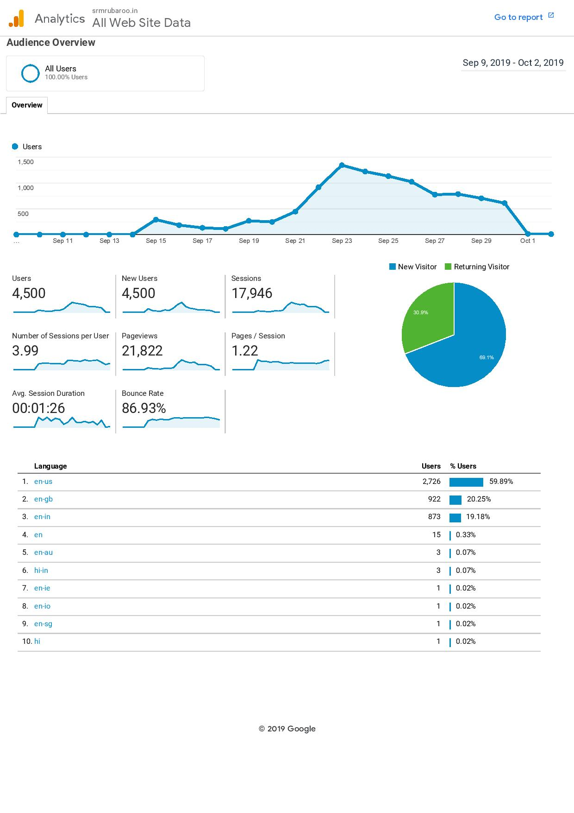

# Rubaroo'19 Official site.
 The official site of SRM's annual cultural fest Rubaroo for the year 2019, ( Rubaroo'19 ).

The site is hosted at https://srmrubaroo.in
 
 The Whole website was written in a period of 3 days from scratch and was optimised for mobile and desktop both. [ does not supports devices 
 with screen size lesser than 360 x 640, i.e. devices similar to iphone 5s/se and similar screen sizes ]
 
 The website is written in HTML, CSS and JS and was intended to be hosted on a node server, but was later shifted to a static website.
 particle.js and slider.js are some of the open source snippets used.
 
 Demo of the desktop version
 
 
 
 Demo of the mobile version
 
 
 
 
 Rubaroo Google Analytics Report

